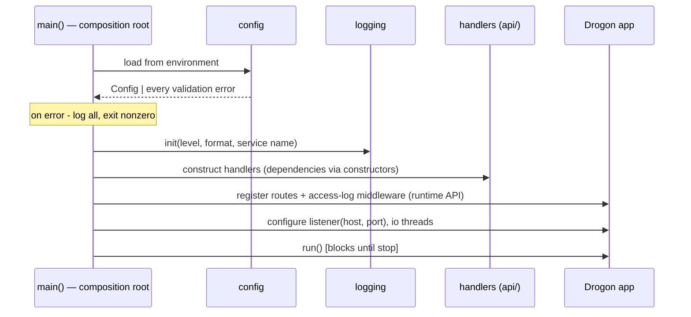
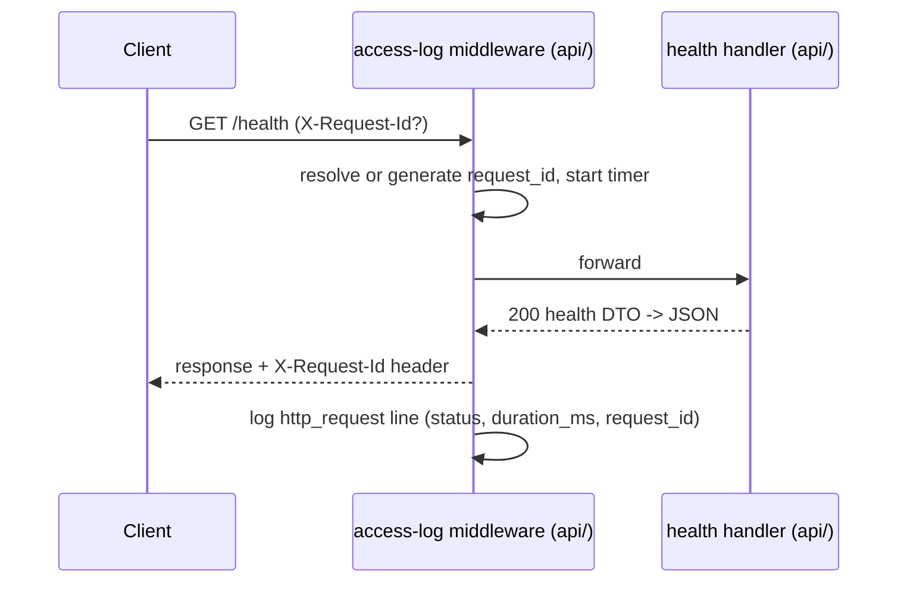

# M1 Design — Server Foundation (User Service)

- **Status:** Approved design; implementation follows approval
- **Date:** 2026-07-30
- **Depends on:** [ADR-0005](../adr/0005-http-framework-drogon.md) (Drogon, three constraints),
  [services contract](../../services/README.md) (canonical layout)

M1 builds the *process*, not the product: one service (`services/user`)
that starts, configures, logs, answers `/health`, runs in a container, and
is tested — with no business endpoints. M2 adds the layered architecture
inside it. Everything decided here becomes the convention every later
service inherits, which is why boring decisions get this much ink.

## Scope

**In:** service skeleton per the canonical layout; Drogon wired at the
composition root under ADR-0005's constraints; configuration, logging,
error-handling foundations; `/health`; request logging with request IDs;
build-info embedding; Dockerfile; unit + integration tests; CI coverage.

**Out (with owners):** business endpoints (M2), persistence (M3), auth
(M4), metrics endpoint (M11), TLS (gateway milestone), readiness vs
liveness split and graceful-shutdown hardening (M14 — `/health` is
liveness-only until a dependency exists to be ready *for*).

## New dependencies (each gets its ADR in the implementation PR)

| Dependency | Problem it solves | Alternatives rejected |
|---|---|---|
| `drogon` | HTTP serving | Decided — [ADR-0005](../adr/0005-http-framework-drogon.md) |
| `spdlog` | Structured logging | Drogon/trantor logger (framework leak into non-api code, defeats constraint 3); Boost.Log (heavy, dated ergonomics); hand-rolled (violates adopt-over-build) → ADR-0006 |
| `tl-expected` | Error-as-value carrier (`std::expected` polyfill) | `std::expected` needs C++23 — a baseline bump rejected for contract stability (revisit at a deliberate toolchain revision); custom Result type (violates adopt-over-build); exceptions-only policy (rejected below) → ADR-0007 |

## Error-handling strategy

**Doctrine: expected failures are values; broken invariants are
exceptions; the process fails fast at startup.**

- **Expected, recoverable failures** (validation errors, not-found,
  conflict — anything a caller can act on) travel as values:
  `tl::expected<T, Error>`, where `Error` is our own type carrying a
  machine-readable kind, a human message, and context fields. Reasoning:
  these are control flow, and exceptions-as-control-flow is banned by
  [principle 4](../engineering-principles.md); additionally, Drogon's
  callback/coroutine handlers make exception propagation across async
  boundaries the wrong default.
- **Programmer errors and broken invariants** (violated preconditions,
  impossible states) are exceptions or assertions — they indicate bugs, and
  bugs should be loud. Drogon's built-in catch-all (500) is the safety net,
  never the mechanism.
- **Startup failures fail fast:** invalid configuration logs every problem
  (not just the first), then exits non-zero before the listener opens. A
  service that half-starts is worse than one that refuses.
- **Wire mapping (api/ owns it):** domain error kinds map to HTTP in one
  table — `Validation→400`, `Unauthorized→401` (M4), `NotFound→404`,
  `Conflict→409`, everything else `→500` with details withheld from the
  client and logged with the request ID. Error bodies use **RFC 9457
  `application/problem+json`** (`type`, `title`, `status`, `detail`,
  `instance` = request ID) — a production-grade contract fixed now, fully
  exercised from M2. In M1 only the framework fallback and the health
  endpoint exist, but the mapper and problem-json envelope are built and
  tested so M2 inherits, not invents.

## Logging strategy

**Doctrine: structured JSON lines to stdout; log at boundaries, not in
depths; every request-scoped line carries a request ID.**

- **Library:** spdlog (ADR-0006). The JSON line is composed safely (proper
  escaping) — no printf-into-JSON string surgery.
- **Sink & format:** stdout only — containers and compose capture it, and
  M11's aggregation consumes it without re-plumbing (12-factor). Format
  selected by config: `json` (default in containers) or `text`
  (human-readable, default for local dev).
- **Standard fields:** `ts` (ISO-8601 UTC, ms), `level`, `service`,
  `event`, `message`, plus per-event context. Request completion lines add
  `method`, `path`, `status`, `duration_ms`, `request_id`:

  ```json
  {"ts":"2026-07-30T12:00:00.123Z","level":"info","service":"user-service","event":"http_request","method":"GET","path":"/health","status":200,"duration_ms":0.4,"request_id":"7f3a2c10-..."}
  ```

- **Request IDs:** incoming `X-Request-Id` is honored; absent, a UUID is
  generated. The ID is echoed in the response header and stamped on every
  request-scoped log line — the seed of distributed tracing, at near-zero
  cost now.
- **Levels:** `error` = failed request/operation needing attention; `warn`
  = degraded but handled; `info` = lifecycle + one line per request;
  `debug` = diagnosis detail, off by default. Level set by config at
  startup.
- **Boundaries, not depths:** the access-log middleware (api/, framework
  AOP — the one place framework hooks belong) and the composition root do
  the logging. Domain code (M2+) returns rich errors instead of logging;
  this kills the double-logging antipattern before it starts. If M2 finds a
  genuine need for domain-level logging, the decision is revisited there.

## Configuration strategy

**Doctrine: process environment > compiled defaults. Nothing else.**

- **Precedence, decided:** exactly two layers. `.env` files are a *delivery
  mechanism* for the environment (docker-compose and dev scripts load
  them), never parsed by the binary — this keeps 12-factor purity, removes
  a parser from the trust boundary, and means the service cannot behave
  differently from what its environment shows. No CLI flags in M1 (nothing
  needs them; revisit trigger: the first operational need, likely
  `--version` at M14).
- **Read once, immutable, validated:** all variables are read at startup
  into one immutable config object passed by the composition root to
  whoever needs it. No component reads the environment directly afterward
  — configuration is a constructor argument like any other dependency.
- **Validation reports everything:** every violated rule is reported in a
  single startup failure (operators fix once, not iteratively). This
  validation is M1's first consumer of `tl::expected`.
- **M1 variable set** (service prefix `USER_SERVICE_`, one table in the
  service README is the authoritative contract):

  | Variable | Default | Validation |
  |---|---|---|
  | `USER_SERVICE_HTTP_HOST` | `0.0.0.0` | non-empty |
  | `USER_SERVICE_HTTP_PORT` | `8080` | integer in [1, 65535] |
  | `USER_SERVICE_LOG_LEVEL` | `info` | one of trace/debug/info/warn/error |
  | `USER_SERVICE_LOG_FORMAT` | `text` | `text` or `json` (Dockerfile sets `json`) |
  | `USER_SERVICE_IO_THREADS` | `1` | integer in [1, 64] — single-threaded until measurement (M8) justifies more |

## Dependency injection & composition-root wiring

**Doctrine: `main.cpp` is the only place that knows the object graph; no
framework, no globals, no service locator.**

Startup sequence (also the file's table of contents):



- **Handlers are plain constructor-injected objects** (M1: a health handler
  taking build info and a clock), owned by the composition root, outliving
  the event loop. Registration uses Drogon's runtime API with thin lambdas
  delegating to handler methods — ADR-0005 constraint 1 (no
  static-registration macros) made concrete.
- **Interfaces only where a test double is needed.** M1 defines exactly
  one: a clock seam (uptime/timestamps in tests). Repository interfaces
  arrive in M2 with their consumers. No speculative abstraction.
- **Lifetime rule:** everything constructed before `run()` is destroyed
  after `run()` returns, in reverse order — RAII gives orderly teardown
  without a shutdown framework. Deeper graceful-shutdown work is M14's.
- **Framework confinement, restated as a build rule:** only `api/` and
  `main.cpp` may include framework headers. From M2, `domain/` compiles as
  a library target with no framework in its link line — the constraint
  becomes mechanical, not aspirational. In M1 this rule is established in
  the service README and enforced by review.

## Health endpoint contract

`GET /health` → `200`, `application/json`, no auth, liveness semantics:

```json
{
  "status": "ok",
  "service": "user-service",
  "version": "0.1.0+g82b7fed",
  "uptime_seconds": 42,
  "timestamp": "2026-07-30T12:00:00Z"
}
```

Version and git SHA are embedded at build time (CMake-generated header) so
a misdeployed binary is identifiable from the endpoint alone. Request flow:



## Container strategy

Multi-stage Dockerfile: build stage (pinned base image, toolchain + vcpkg
at the manifest baseline) → runtime stage (slim Debian, the binary and its
runtime libraries only, **non-root user**, `HEALTHCHECK` wired to
`/health`, `USER_SERVICE_LOG_FORMAT=json` set). Image is buildable on any
machine and in CI's Linux job; compose integration waits for M3 when
there is a second container to compose. Build-stage cost (vcpkg compile) is
accepted for M1 and recorded; optimizing image build time gets a trigger
in the exit review, not speculative work now.

## Proof-of-work checklist (acceptance criteria)

M1 is done when every box below is checked and the exit review links the
evidence. Each criterion is pass/fail measurable.

**Build & CI**
- [ ] CI matrix green (Windows/MSVC, Linux/GCC+ASan/UBSan) with the service included; format check green.
- [ ] Linux CI job builds the Docker image successfully.

**Configuration**
- [ ] Service starts with zero environment variables set (all defaults valid).
- [ ] Each validation rule in the config table has a negative test; invalid config → exit code ≠ 0, no listener opened, and stderr/log names **every** offending variable (test sets two invalid vars, asserts both reported).

**HTTP & observability**
- [ ] Integration test: `GET /health` returns 200 with exactly the documented fields; `version` matches the built SHA.
- [ ] Integration test: response echoes a supplied `X-Request-Id`; a second request without the header receives a generated non-empty ID.
- [ ] Integration test: each request produces exactly one parseable JSON log line containing `method`, `path`, `status`, `duration_ms`, `request_id` (parsed, not grepped).
- [ ] Unknown route returns the problem+json envelope with status 404.

**Quality**
- [ ] Unit tests cover the health handler (via the clock seam) and every config validation rule; all tests pass under ASan/UBSan on Linux.
- [ ] clang-tidy clean on all new first-party code (local run; CI enforcement lands in M2 as planned).
- [ ] No framework include outside `api/` and `main.cpp` (verified by review; mechanical check lands with the M2 library split).

**Container**
- [ ] `docker build` succeeds; `docker run` with only `-e` configuration serves `/health` from the host; process UID in container ≠ 0; Docker `HEALTHCHECK` reports healthy within 10 s of start.

**Baselines & docs**
- [ ] Recorded in the exit review: binary size (Release), container image size, cold-start time to first successful `/health` (3-run median), and CI wall-clock time — M8 inherits these numbers.
- [ ] Service README (with the config table), ADR-0006 (spdlog), ADR-0007 (tl-expected), interview entries for Drogon/HTTP serving and structured logging, handbook chapter statuses updated, M1 exit review written.

## Risks

- **Drogon's runtime registration path** is less traveled than its macro
  path; if composition-root wiring fights the framework, ADR-0005's
  reversal condition triggers. Probed in the first implementation days.
- **JSON log line integrity** under concurrency (interleaved writes) —
  addressed by spdlog's synchronized sink; verified by the log-parsing
  test.
- **Windows Docker experience** differs (Linux containers via WSL2);
  acceptance criteria for containers are evaluated on Linux, documented as
  such.
