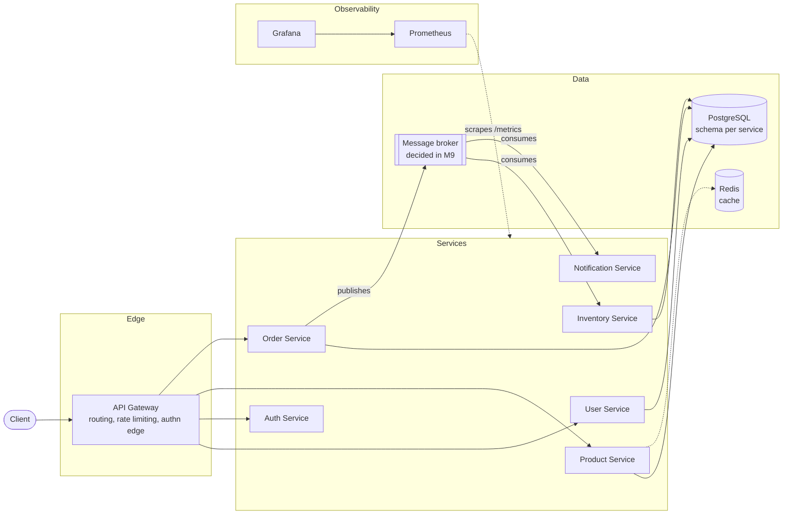

# System Overview

## Current state (after M2)

One service exists — the User Service walking skeleton — with the layer
contract every later service copies: framework-confined transport,
framework-free domain, a repository seam (in-memory today, PostgreSQL in
M3), structured logging with request IDs, and problem+json errors. The
rest of this document shows the *destination*, and the table below maps
how each part gets earned. Keeping target and current state in one honest
document is deliberate — see
[philosophy: documentation is a deliverable](../philosophy.md).

## Target architecture

## Standing constraints

These hold for every component, from the first line of service code:

- Every service runs independently: own build, own container, own
  configuration, no compile-time dependency on another service.
- All configuration via environment variables; no fixed IPs or hardcoded
  paths anywhere (development spans machines and home-network DHCP).
- Health endpoints from each service's first milestone; metrics endpoints
  once a scraper exists (M11).
- Data ownership per service — no service reaches into another's schema.

## How the architecture gets earned

| Component | Arrives | Justified by |
|---|---|---|
| User Service (walking skeleton) | M1–M2 | First vertical slice; proves every convention |
| PostgreSQL | M3 | First real persistence need |
| Auth Service, JWT | M4 | Protecting the first real endpoints |
| Product Service, REST-vs-gRPC decision | M6 | First service-to-service call (after M5 networking fundamentals) |
| API Gateway | M7 | More than one service to route to |
| Message broker (ADR: Kafka vs RabbitMQ vs Redpanda) | M9 | Order/Inventory create real events |
| Redis | M10 | Only if M8 baselines show a problem caching solves |
| Prometheus + Grafana | M11 | Multiple services worth watching |
| Notification (+ Audit if justified) | M13 | Real consumers for the broker |

Sequence diagrams are added per feature as features appear, in this
directory, per the documentation standards.
