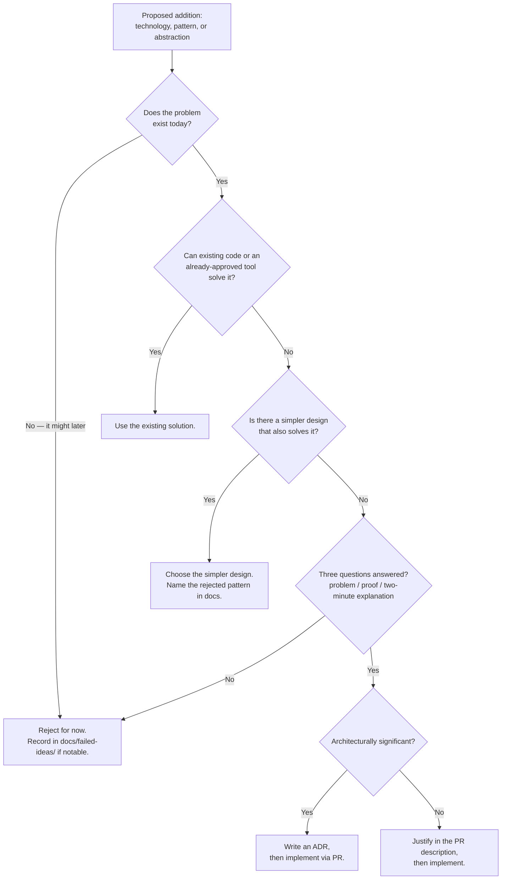

# Decision Tree

The standard path by which any technology, pattern, or abstraction enters
this repository. Applying it consistently is what keeps the codebase free of
speculative infrastructure.

"Architecturally significant" means: expensive to reverse, visible across
service boundaries, or constraining future milestones. A new dependency is
almost always significant; a refactor inside one module almost never is.

## Additional gate for new dependencies

Before any library enters `vcpkg.json`, the ADR must answer:

1. What does it cost to build (compile time, binary size, transitive deps)?
2. Is it actively maintained, and what is the security track record?
3. What would writing the needed subset ourselves cost, honestly?
4. How hard is it to remove later if it disappoints?

## The tree applied — worked examples

**Kafka at project start — rejected.** Failed the first gate: no service
produces events yet, so the problem does not exist today. Recorded in
[failed-ideas/0002](failed-ideas/0002-kafka-from-day-one.md); messaging gets
a full ADR in M9 when Order and Inventory create the problem.

**GoogleTest at M0 — accepted.** The problem exists (M0's proof requires an
executable test), no existing tool covers it, nothing simpler provides
assertions plus the mocking we need by M2, and the choice is architecturally
significant → [ADR-0004](adr/0004-googletest.md).

**Dependency-injection framework — rejected without a failed-ideas entry.**
A simpler design (constructor wiring in the composition root) solves the
problem completely at this scale. The rejection is recorded where the
simpler design is documented
([engineering principle 3](engineering-principles.md)).
